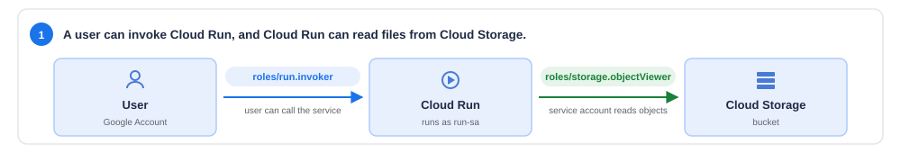
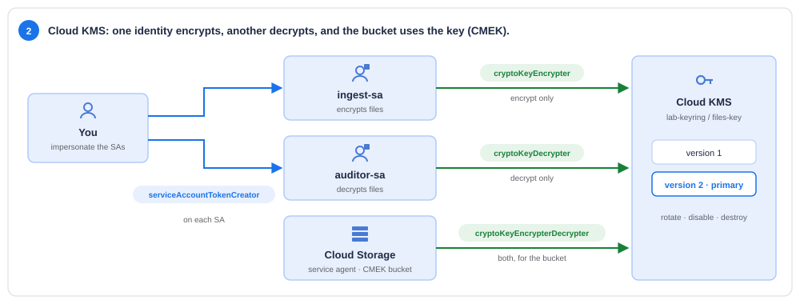
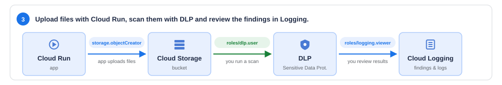
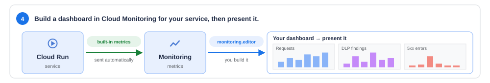

# GCP Security — IAM · Secret Manager · KMS · DLP · Logging · Monitoring

Four short activities that put into practice the **Google Security and Logging** session:

| # | Activity | Topic | Time |
|---|---|---|---|
| — | [Setup](#setup-5-min): prepare the project (one script) | — | 5 min |
| **1** | [Cloud Run with a secret from Secret Manager](#activity-1--cloud-run-with-a-secret-from-secret-manager-20-min) | Secret Manager · IAM | 20 min |
| **2** | [Encrypt data with Cloud KMS](#activity-2--encrypt-data-with-cloud-kms-20-min) | Cloud KMS · IAM | 20 min |
| **3** | [Scan files with DLP and review the findings in Logging](#activity-3--scan-files-with-dlp-and-review-them-in-logging-20-min) | DLP · Logging | 20 min |
| **4** | [Build and present a dashboard](#activity-4--build-and-present-a-dashboard-20-min) | Monitoring | 20 min + 3 min per team |

Each activity builds on the previous one, so do them in order.

---

## Before you start

- A Google Cloud project with billing enabled, where you are **Owner**.
- **Cloud Shell** (the `>_` icon at the top right of the console).
- Work in **pairs** if you can: some optional steps ask you to grant a role to your partner and check what they can (and cannot) do.

> [!WARNING]
> **Cost:** a few cents, as long as you run the [clean-up](#clean-up) at the end.

> [!IMPORTANT]
> The files in `sample_data/` contain **made-up** personal data: test card numbers, fictitious DNIs and emails on `example.com`. Never upload real data to a lab.


---

## Setup (5 min)

```bash
git clone https://github.com/<your-user>/gcp-security-activities.git
cd gcp-security-activities
gcloud config set project <YOUR_PROJECT_ID>
source scripts/00-env.sh
bash scripts/setup.sh
```

The script enables the APIs and creates what is *not* part of the exercise:

- a bucket `gs://<project>-lab-files` with a file `reports/sales_by_city.csv`;
- the container image of the app (`file-service`) in Artifact Registry, so deploying in Activity 1 takes seconds.

> [!TIP]
> **Instructor:** if you ask students to run `setup.sh` before class, Activity 1 starts straight away.

---

## Activity 1 · Cloud Run with a secret from Secret Manager (20 min)



**Goal:** deploy a private Cloud Run service that protects its endpoints with an **API key stored in Secret Manager**, reads files from Cloud Storage, and survives a **key rotation**.

**Key idea:** in IAM, a policy is **principal + role, attached to a resource**. Here there are **two different principals**:

- **you** (a person), who needs to *call* the service;
- **`run-sa`** (the app's identity), which needs to *read the secret* and *read the bucket*.

Each one gets **only its role**, and **on the specific resource**: one secret, one bucket. Never the whole project.

**1. Give the app its own identity**

```bash
gcloud iam service-accounts create run-sa --display-name="file-service (Cloud Run)"
```

**2. Store the API key in Secret Manager**

Generate a random key and save it as a secret. It goes straight from `openssl` into Secret Manager: it is never written to a file or to your shell history.

```bash
openssl rand -hex 16 | tr -d '\n' | \
  gcloud secrets create $SECRET --replication-policy=automatic --data-file=-

gcloud secrets versions list $SECRET
```

A secret is a container; the value lives in **versions** (`1`, `2`, …). You will need that later.

**3. Deploy the service, with the secret as an environment variable**

The image was already built by `setup.sh`. Read [`app/main.py`](app/main.py): the code **has no credentials and no key**. Cloud Run reads the secret and passes it to the container as `API_KEY`.

```bash
gcloud run deploy $SERVICE --image=$IMAGE --region=$REGION \
  --service-account=$RUN_SA \
  --no-allow-unauthenticated \
  --set-env-vars=BUCKET_NAME=$BUCKET \
  --set-secrets=API_KEY=$SECRET:latest
```

It fails. Read the message:

```text
Permission denied on secret: projects/.../secrets/file-service-api-key/versions/latest
for Revision service account run-sa@....
The service account used must be granted the 'Secret Manager Secret Accessor' role ...
```

Cloud Run checks **at deploy time** that the service's identity can read the secret. Note *whose* permission is missing: not yours (you are Owner), but **`run-sa`'s**.

**4. Grant `roles/secretmanager.secretAccessor` on that secret only**

```bash
gcloud secrets add-iam-policy-binding $SECRET \
  --member="serviceAccount:$RUN_SA" --role="roles/secretmanager.secretAccessor"
```

Run the `gcloud run deploy` command from step 3 again. This time it works.

```bash
source scripts/00-env.sh      # loads $URL and $API_KEY
```

**5. Three layers, three different errors**

Call the service step by step. Each call fails at a different layer:

```bash
export TOKEN=$(gcloud auth print-identity-token)

# a) No identity → Cloud Run's IAM (roles/run.invoker) stops it before it reaches the code
curl -s -o /dev/null -w "%{http_code}\n" $URL/files
# 403

# b) Identity but no API key → the app stops it
curl -s -H "Authorization: Bearer $TOKEN" $URL/files
# {"error": "missing or invalid X-API-Key header"}   (401)

# c) Identity + API key → the app runs, but run-sa cannot read the bucket
curl -s -H "Authorization: Bearer $TOKEN" -H "X-API-Key: $API_KEY" $URL/files
# {"action": "storage.objects.list", "error": "permission denied", ...}   (403)
```

Grant the last missing role, **on the bucket**:

```bash
gcloud storage buckets add-iam-policy-binding gs://$BUCKET \
  --member="serviceAccount:$RUN_SA" --role="roles/storage.objectViewer"
```

Wait about 30 s and repeat call c):

```bash
curl -s -H "Authorization: Bearer $TOKEN" -H "X-API-Key: $API_KEY" $URL/files
# {"bucket": "...", "files": ["reports/sales_by_city.csv"]}
```

**6. Rotate the key**

The key has leaked (say, someone pasted it in a chat). Create a new version:

```bash
openssl rand -hex 16 | tr -d '\n' | gcloud secrets versions add $SECRET --data-file=-
source scripts/00-env.sh      # $API_KEY is now version 2
curl -s -o /dev/null -w "%{http_code}\n" -H "Authorization: Bearer $TOKEN" -H "X-API-Key: $API_KEY" $URL/files
```

**401!** The service is still using the **old** key, even though it points to `latest`. A secret exposed as an environment variable is read **once, when the instance starts**. To pick up the new one you need a new revision. Use the chance to **pin an explicit version** instead of `latest`, so you always know which key is live:

```bash
gcloud run services update $SERVICE --region=$REGION --update-secrets=API_KEY=$SECRET:2
curl -s -o /dev/null -w "%{http_code}\n" -H "Authorization: Bearer $TOKEN" -H "X-API-Key: $API_KEY" $URL/files
# 200
```

Finally, **disable** the leaked version so nobody can read it any more:

```bash
gcloud secrets versions disable 1 --secret=$SECRET
gcloud secrets versions list $SECRET
```

✅ **Check:** `/files` returns the list with the new key, and version 1 is `DISABLED`.

> [!NOTE]
> If you mount the secret as a **file** (`--set-secrets=/secrets/api-key=$SECRET:latest`) instead of an environment variable, Cloud Run reads it every time the file is opened, so rotation does not need a new revision.

**7. (Pairs, optional) Metadata vs value**

Give your partner `run.invoker` on the service and `secretmanager.viewer` on the secret:

```bash
gcloud run services add-iam-policy-binding $SERVICE --region=$REGION \
  --member="user:<partner-email>" --role="roles/run.invoker"
gcloud secrets add-iam-policy-binding $SECRET \
  --member="user:<partner-email>" --role="roles/secretmanager.viewer"
```

Your partner can run `gcloud secrets versions list file-service-api-key --project=<your-project>` and see the versions, but `gcloud secrets versions access 2 ...` returns **PERMISSION_DENIED**. `viewer` shows the **metadata**; only `secretAccessor` reveals the **value**. Without the key, their calls get a 401 even though IAM lets them in.

<details>
<summary>Activity 1 questions</summary>

1. *In step 5, which principal or mechanism stopped each call (a, b, c)?*
   a) **you**, missing `run.invoker` (Cloud Run IAM). b) the **app**, because the API key was missing (not IAM). c) **`run-sa`**, missing `storage.objectViewer` on the bucket.
2. *Why grant `secretAccessor` on the secret and not on the project?*
   On the project, `run-sa` could read **every** secret in it (database passwords, other teams' keys…). On the secret, it reads only the one it needs.
3. *Why did the service keep accepting the old key after you added version 2?*
   Environment-variable secrets are resolved when the instance starts. You need a new revision, and pinning a version (`:2`) makes the rotation explicit.
</details>

---

## Activity 2 · Encrypt data with Cloud KMS (20 min)



**Goal:** encrypt a customer file with a key you manage in **Cloud KMS**, so that **the identity that encrypts cannot decrypt**, rotate the key, and then use the same key to protect the bucket (**CMEK**).

**Story:** an *ingest* process encrypts customer files before archiving them. Only the *auditor* may decrypt them. Two service accounts, two opposite roles: **separation of duties**.

**1. Create a key ring and a key**

```bash
gcloud kms keyrings create $KEYRING --location=$REGION
gcloud kms keys create $KEY --keyring=$KEYRING --location=$REGION --purpose=encryption
gcloud kms keys versions list --key=$KEY --keyring=$KEYRING --location=$REGION
```

The key material never leaves KMS: you send it data and it returns ciphertext. Like secrets, keys have **versions**.

> [!NOTE]
> Key rings and keys **cannot be deleted** (only their versions can be destroyed). If you repeat the lab in the same project, the create commands say "already exists": that's fine, carry on.

**2. Two identities, and permission for you to act as them**

```bash
gcloud iam service-accounts create ingest-sa  --display-name="Encrypts customer files"
gcloud iam service-accounts create auditor-sa --display-name="Decrypts customer files"

for SA in $INGEST_SA $AUDITOR_SA; do
  gcloud iam service-accounts add-iam-policy-binding $SA \
    --member="user:$(gcloud config get-value account)" \
    --role="roles/iam.serviceAccountTokenCreator"
done
```

`serviceAccountTokenCreator` on a service account lets you **impersonate** it: run commands *as* that account, with **its** permissions, not yours. That way the test is honest: as Owner you could do everything, and that is exactly what we want to avoid. It can take a minute to propagate.

**3. Encrypt as `ingest-sa` → `roles/cloudkms.cryptoKeyEncrypter`**

```bash
gcloud kms encrypt --key=$KEY --keyring=$KEYRING --location=$REGION \
  --plaintext-file=sample_data/customers.csv --ciphertext-file=customers.csv.enc \
  --impersonate-service-account=$INGEST_SA
```

**PERMISSION_DENIED** on `cloudkms.cryptoKeyVersions.useToEncrypt`. (If instead you see an error about `getAccessToken`, step 2 has not propagated yet: wait a minute.) Grant **only encrypt**, **on the key**:

```bash
gcloud kms keys add-iam-policy-binding $KEY --keyring=$KEYRING --location=$REGION \
  --member="serviceAccount:$INGEST_SA" --role="roles/cloudkms.cryptoKeyEncrypter"
```

Wait 30 s and repeat. Now look at the result: `head -c 200 customers.csv.enc | xxd | head`. Unreadable.

**4. Decrypt: who can and who cannot**

`ingest-sa` tries to decrypt what it just encrypted:

```bash
gcloud kms decrypt --key=$KEY --keyring=$KEYRING --location=$REGION \
  --ciphertext-file=customers.csv.enc --plaintext-file=out.csv \
  --impersonate-service-account=$INGEST_SA
```

**PERMISSION_DENIED** on `useToDecrypt`. **That is the goal, not a bug**: the ingest process does not need to read the data back. Now the auditor:

```bash
gcloud kms keys add-iam-policy-binding $KEY --keyring=$KEYRING --location=$REGION \
  --member="serviceAccount:$AUDITOR_SA" --role="roles/cloudkms.cryptoKeyDecrypter"
```

Wait 30 s and repeat the decrypt command with `--impersonate-service-account=$AUDITOR_SA`, then:

```bash
diff sample_data/customers.csv out.csv && echo "Identical"
```

✅ **Check:** `ingest-sa` encrypts but cannot decrypt; `auditor-sa` decrypts.

**5. Rotate the key, then switch off the old version**

```bash
gcloud kms keys versions create --key=$KEY --keyring=$KEYRING --location=$REGION --primary
gcloud kms keys versions list --key=$KEY --keyring=$KEYRING --location=$REGION
```

Version 2 is now **primary**: new encryptions use it. Repeat the auditor's decrypt of `customers.csv.enc`: **it still works**. The ciphertext records which version encrypted it, and version 1 is still enabled. Rotating does not force you to re-encrypt old data.

Now **disable** version 1 and try again:

```bash
gcloud kms keys versions disable 1 --key=$KEY --keyring=$KEYRING --location=$REGION
# repeat the auditor's decrypt → FAILED_PRECONDITION: ... is not enabled
gcloud kms keys versions enable 1 --key=$KEY --keyring=$KEYRING --location=$REGION
```

Not even the auditor can read it while the version is disabled. If it were **destroyed**, the data would be lost forever (*crypto-shredding*). Enable it again before moving on.

> [!TIP]
> In production, set automatic rotation: `gcloud kms keys update $KEY ... --rotation-period=90d --next-rotation-time=...`.

**6. Protect the bucket with your key (CMEK) → the Cloud Storage service agent**

Upload a file to the bucket encrypted with your key:

```bash
gcloud storage cp sample_data/sales_by_city.csv gs://$BUCKET/reports/cmek-test.csv \
  --encryption-key=$KEY_NAME
```

It fails: *"Permission denied on Cloud KMS key. Please ensure that your Cloud Storage service account has been authorized to use this key."* The one who encrypts is **neither you nor `run-sa`**: it is Cloud Storage itself, through its **service agent** (a Google-managed service account for your project):

```bash
GCS_SA=$(gcloud storage service-agent)
echo $GCS_SA        # service-<number>@gs-project-accounts.iam.gserviceaccount.com

gcloud kms keys add-iam-policy-binding $KEY --keyring=$KEYRING --location=$REGION \
  --member="serviceAccount:$GCS_SA" --role="roles/cloudkms.cryptoKeyEncrypterDecrypter"
```

Wait 30 s, repeat the upload, and check:

```bash
gcloud storage objects describe gs://$BUCKET/reports/cmek-test.csv --format="value(kms_key)"
```

Make it the bucket's **default key**, so everything uploaded from now on (including Activity 3) is encrypted with it:

```bash
gcloud storage buckets update gs://$BUCKET --default-encryption-key=$KEY_NAME
```

Finally, read the CMEK file through the app from Activity 1:

```bash
curl -s -H "Authorization: Bearer $TOKEN" -H "X-API-Key: $API_KEY" $URL/files/reports/cmek-test.csv
```

It works, although **`run-sa` has no KMS role**. Cloud Storage decrypts transparently with its service agent; `run-sa` only needs `storage.objectViewer`.

✅ **Check:** `cmek-test.csv` shows your `kms_key`, and the bucket has a default encryption key.

<details>
<summary>Activity 2 questions</summary>

1. *Why give `ingest-sa` `cryptoKeyEncrypter` and not `cryptoKeyEncrypterDecrypter`?*
   If the ingest process is compromised, the attacker still cannot decrypt the archive. Separation of duties: whoever writes the data does not need to read it.
2. *Why impersonate the service accounts instead of running the commands as yourself?*
   As Owner you have very broad permissions, so the test would prove nothing. Impersonating shows what **that identity** can do, and it is how you test least privilege.
3. *For CMEK on the bucket, which principal needs a KMS role: you, `run-sa` or the Cloud Storage service agent?*
   Only the **Cloud Storage service agent**. Storage encrypts and decrypts on behalf of anyone who has storage permissions on the object.
4. *What happens to the data if you destroy every version of the key?*
   It becomes unrecoverable, for everyone, including Google. That is crypto-shredding: a way of deleting data you cannot reach directly (backups, copies).
</details>

---

## Activity 3 · Scan files with DLP and review them in Logging (20 min)



The service from Activity 1 now also lets you **upload files**. Users will upload customer lists and support tickets full of personal data. Your job: **find it with DLP and record it in Logging** (in Activity 4 you will watch it all on a dashboard).

**1. The app needs to write: `roles/storage.objectCreator`**

Try to upload a file:

```bash
export TOKEN=$(gcloud auth print-identity-token)
curl -s -X POST $URL/upload -H "Authorization: Bearer $TOKEN" -H "X-API-Key: $API_KEY" -F "file=@sample_data/customers.csv"
# {"action": "storage.objects.create", "error": "permission denied", ...}
```

`objectViewer` (from Activity 1) only allows reading. Add the role that allows **creating** objects:

```bash
gcloud storage buckets add-iam-policy-binding gs://$BUCKET \
  --member="serviceAccount:$RUN_SA" --role="roles/storage.objectCreator"
```

Wait 30 s and upload the two files:

```bash
curl -s -X POST $URL/upload -H "Authorization: Bearer $TOKEN" -H "X-API-Key: $API_KEY" -F "file=@sample_data/customers.csv"
curl -s -X POST $URL/upload -H "Authorization: Bearer $TOKEN" -H "X-API-Key: $API_KEY" -F "file=@sample_data/support_tickets.txt"
# {"stored": "gs://.../uploads/3f9a1c2b-customers.csv"}
```

> [!NOTE]
> `objectCreator` creates but **cannot overwrite or delete**. That is why the app adds a random prefix to each name.

Thanks to the default key from Activity 2, the uploads are already encrypted with **your** KMS key, and `run-sa` still needs no KMS role:

```bash
gcloud storage objects list "gs://$BUCKET/uploads/" --format="table(name, kms_key.basename())"
```

**2. Prepare the metric before scanning**

The DLP script writes **one log entry per finding**. To chart them later in Activity 4, create now a **log-based metric** that counts them by InfoType. It only counts entries that arrive *after* it is created.

```bash
gcloud logging metrics create dlp_findings --config-from-file=monitoring/dlp_findings_metric.yaml
```

**3. Scan with DLP → `roles/dlp.user`**

The person running the scan needs `roles/dlp.user` (as Owner you already have it):

```bash
pip install --quiet -r dlp/requirements.txt
python dlp/scan_and_log.py $BUCKET
```

```text
uploads/3f9a1c2b-customers.csv                 27 findings  → masked copy: masked/3f9a1c2b-customers.csv
uploads/8d2e4b10-support_tickets.txt           10 findings  → masked copy: masked/8d2e4b10-support_tickets.txt

Total by InfoType:
  EMAIL_ADDRESS          8
  PHONE_NUMBER           7
  ...
```

The exact numbers may vary slightly, because DLP uses statistical models. Compare an original file with its masked copy:

```bash
gcloud storage cat "gs://$BUCKET/masked/*customers.csv" | head -3
```

**4. Review the findings in Cloud Logging → `roles/logging.viewer`**

Open **Logging → Logs Explorer** and run these queries. Read each result before going to the next.

```text
logName:"dlp-findings" AND jsonPayload.event="dlp_finding"
```
→ One entry per finding. Use **Fields → jsonPayload.info_type** in the left panel to see the count by type.

```text
logName:"dlp-findings" AND jsonPayload.event="dlp_finding" AND severity>=WARNING
```
→ Only findings with high likelihood (`LIKELY` or `VERY_LIKELY`).

```text
resource.type="cloud_run_revision" AND jsonPayload.event="permission_denied"
```
→ The errors from Activities 1 and 3: **the app logged every time IAM said no**, and which permission was missing.

```text
resource.type="cloud_run_revision" AND jsonPayload.event="invalid_api_key"
```
→ The calls with a wrong or old API key (Activity 1, after the rotation). The log says *that* the key was wrong, never *which* key was sent.

The same thing from the terminal:

```bash
gcloud logging read 'logName:"dlp-findings" AND jsonPayload.event="dlp_finding"' --freshness=1h --limit=10 \
  --format='table(timestamp.date("%H:%M:%S"), severity, jsonPayload.info_type, jsonPayload.likelihood, jsonPayload.object)'
```

> [!IMPORTANT]
> Look at a log entry: it records the **type** of data (`CREDIT_CARD_NUMBER`) and the file, but **never the number itself**. If you logged the sensitive value, you would be copying personal data into another place: the logs.

**Pairs, optional:** grant your partner `roles/logging.viewer` on your project. They can read your logs, but they cannot see the files in the bucket.

✅ **Check:** you see the findings in Logs Explorer, and a masked copy of each file exists under `masked/`.

<details>
<summary>Activity 3 questions</summary>

1. *Which 4 roles take part in this activity, and who has each one?*
   `storage.objectViewer` + `storage.objectCreator` → `run-sa`; `dlp.user` and `logging.viewer` → you.
2. *Why doesn't `run-sa` need `dlp.user`?* Because the app does not call DLP: the scan is run by a person (or another process with its own identity).
3. *Which file has more findings and why?* `customers.csv`: it is a table with personal data in every column. The tickets mix free text with only a few data points.
</details>

---

## Activity 4 · Build and present a dashboard (20 min)



**Goal:** build a dashboard in **Cloud Monitoring** (`roles/monitoring.editor`) that would let a security team see, at a glance, how the service is doing and how much sensitive data is coming in. **Afterwards you present it.**

**1. Generate traffic in a second Cloud Shell tab**

Open another tab (`+`), then:

```bash
cd gcp-security-activities && source scripts/00-env.sh
bash scripts/generate-traffic.sh 10
```

It simulates 10 minutes of real use: listings, reads, uploads, **404s** (files that do not exist) and **403s** (calls without a token). While it runs, go on to the next step.

**2. Run the scan again so the metric has data**

```bash
python dlp/scan_and_log.py $BUCKET
```

**3. Build the dashboard in the console**

**Monitoring → Dashboards → Create dashboard**. Give it a name with your team: `File Service — Team <name>`.

Add these widgets with **+ Add widget → Line / Stacked bar** and pick the metric with the selector:

| # | Widget | Metric to search for | Configuration |
|---|---|---|---|
| 1 | **Requests by response class** | `Cloud Run Revision › Request Count` | Filter `service_name = file-service` · Group by `response_code_class` |
| 2 | **Latency p95** | `Cloud Run Revision › Request Latencies` | Filter `service_name = file-service` · Aggregation **95th percentile** |
| 3 | **DLP findings by type** | `logging/user/dlp_findings` | Group by `info_type` · Stacked bar |
| 4 | **Your choice** | any metric you like | e.g. instances (`Container Instance Count`), 4xx errors only, a *scorecard*… |

> [!TIP]
> If you get stuck, you can import the solution with `gcloud monitoring dashboards create --config-from-file=monitoring/dashboard-solution.json`. **But the one you present must be yours**, with at least widget 4 chosen by you.

**4. Prepare the presentation**

Take a screenshot of the dashboard and prepare the presentation (step 5).

✅ **Check:** the 4 widgets show data. If one is empty, wait 2 minutes: metrics arrive with a delay.

**5. Present your dashboard**

Each team has **3 minutes** and answers these four points, with the dashboard on screen:

1. **What it shows.** One sentence per widget: what it measures and why it matters for security.
2. **What you saw.** At least **one real observation** from your data. For example: *"10% of the requests are 403: calls without a token"*, or *"most findings are EMAIL_ADDRESS"*.
3. **Your widget.** Why you chose widget 4 and what question it answers.
4. **Which alert would you create?** Name one alerting policy that would be built on this dashboard. For example: *"notify if `dlp_findings` of type CREDIT_CARD_NUMBER goes above 0 in 5 minutes"*.

**Evaluation guide (for the instructor):**

| Criterion | 0 | 1 | 2 |
|---|---|---|---|
| The 4 widgets work and are understandable | — | some empty or no title | all with data and a clear title |
| They explain what each widget measures | no | partly | yes, linked to security |
| Real observation from their data | none | generic | specific, with numbers |
| Proposed alert | none | vague | metric + threshold + window |

---

## Clean up

```bash
source scripts/00-env.sh
bash scripts/cleanup.sh
```

This deletes the service, bucket, secret, metric, solution dashboard, service accounts and image repository, and **destroys every KMS key version** (key rings and keys cannot be deleted in Google Cloud, but destroyed versions cost nothing). **Delete your team dashboard by hand** in Monitoring → Dashboards, and remove any roles you granted to your partner.

---

## References

[IAM roles for Cloud Run](https://cloud.google.com/run/docs/reference/iam/roles) ·
[Cloud Storage IAM roles](https://cloud.google.com/storage/docs/access-control/iam-roles) ·
[Secret Manager with Cloud Run](https://cloud.google.com/run/docs/configuring/services/secrets) ·
[Cloud KMS roles](https://cloud.google.com/kms/docs/reference/permissions-and-roles) ·
[CMEK for Cloud Storage](https://cloud.google.com/storage/docs/encryption/customer-managed-keys) ·
[Service account impersonation](https://cloud.google.com/iam/docs/service-account-impersonation) ·
[Sensitive Data Protection InfoTypes](https://cloud.google.com/sensitive-data-protection/docs/infotypes-reference) ·
[Log-based metrics with labels](https://cloud.google.com/logging/docs/logs-based-metrics/labels) ·
[Cloud Monitoring dashboards](https://cloud.google.com/monitoring/dashboards)
